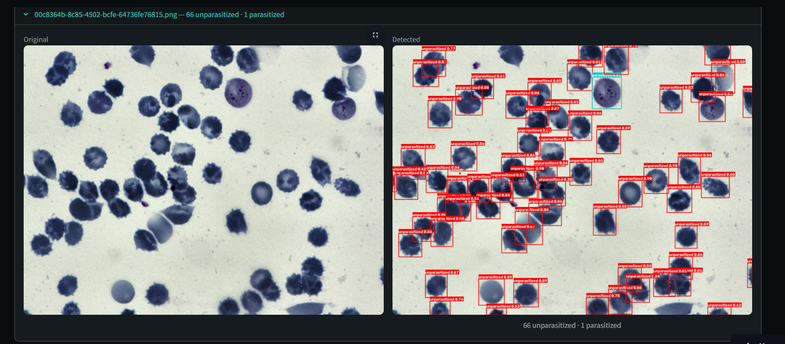

# MalariaScope

**AI-assisted parasitemia estimation from thin blood smear microscopy**

[](https://malaria-scope.streamlit.app/)
[](https://www.python.org/)
[](https://streamlit.io/)
[](https://github.com/ultralytics/ultralytics)
[](LICENSE)

**[Try the live app →](https://malaria-scope.streamlit.app/)**


*Original field (left) vs. YOLO detection output (right): 22 unparasitized, 2 parasitized red blood cells.*

---

## Overview

Malaria diagnosis by microscopy is the clinical gold standard, but it's slow, subjective, and depends heavily on the microscopist's experience — a serious bottleneck in low-resource settings where trained personnel are scarce. WHO and CDC protocols both require counting hundreds to thousands of red blood cells across multiple fields to produce a statistically reliable parasitemia estimate; a single field is too small a sample even for experts at low parasite densities.

**MalariaScope** is an object-detection pipeline that automates this counting step. A user uploads several microscope field images from one slide, the model detects and classifies every red blood cell as parasitized or unparasitized, and the app aggregates counts across all fields into a single clinically-grounded parasitemia percentage — with severity context drawn from published CDC and WHO thresholds.

Built as the capstone project for the **3MTT Fellowship (Data Science, ML & AI track)**.

## Key Features

- **Multi-field aggregation** — sums RBC counts across all uploaded images *before* computing a single percentage, rather than averaging per-image percentages (the correct method per CDC/WHO counting guidance — averaging misweights sparse vs. dense fields).
- **Clinically-referenced severity bands** — flags results against the CDC's 5% severe-disease threshold and WHO's 10% hyperparasitemia threshold, since the two bodies use different cutoffs.
- **Sample-size confidence rating** — tells the user whether enough RBCs were counted for a statistically reliable estimate, benchmarked against CDC (500 RBC minimum) and WHO (~5,000 RBC) recommendations.
- **Visual verification** — per-field original vs. annotated bounding-box comparison, so results aren't a black box.
- **CSV export** of per-image detection counts.

## Model Performance

Trained on [BBBC041](https://bbbc.broadinstitute.org/BBBC041) (Broad Bioimage Benchmark Collection), a labeled thin blood smear dataset.

| Class | Precision | Recall | mAP50 | mAP50-95 |
|---|---|---|---|---|
| Unparasitized | 0.943 | 0.964 | 0.976 | 0.800 |
| Parasitized | 0.814 | 0.688 | 0.793 | 0.625 |

*Base model: `yolo26n`. Training config: 640px, batch 16, `copy_paste=0.3`, `cls=4.0`, early-stopped at epoch 31/46 (patience 15).*

## Engineering Decisions Worth Noting

This project involved more judgment calls than a standard "train a model on a dataset" exercise:

**Class collapse (7 → 2 classes).** BBBC041 ships with 7 fine-grained classes (ring, trophozoite, schizont, gametocyte, leukocyte, difficult, red blood cell). For a parasitemia-counting tool, infection *status* matters more than infection *stage*. After visual inspection of sample crops per class:
- `difficult` was folded into `parasitized` — visual review showed these crops share the granular/stippled texture of confirmed-infected cells; per the dataset's own documentation, "difficult" reflected annotator uncertainty about *stage*, not about infection status.
- `leukocyte` was dropped entirely rather than merged into either class — it's a structurally distinct cell type, and merging it into "unparasitized" would have corrupted the RBC-only denominator used for the parasitemia calculation.

**Severe class imbalance (~28:1).** The 2-class dataset skews heavily toward unparasitized cells (~83k vs. ~2.9k instances). Addressed with a combination of `copy_paste` augmentation and an increased classification loss weight (`cls=4.0`) to push recall on the minority (parasitized) class — the clinically important error direction, since missed infections are far more dangerous than false positives.

**Aggregation methodology.** Parasitemia % is computed by summing infected/total RBC counts across *all* uploaded fields first, then dividing once — matching CDC/WHO counting protocol, rather than the naive (and statistically incorrect) approach of averaging each field's individual percentage.

## Tech Stack

`Python` · `Ultralytics YOLO` · `OpenCV` · `Streamlit` · `NumPy` · `Pandas` · `PIL`

## Project Structure

```
malaria-scope/
├── app.py              # Streamlit app: UI, inference, aggregation, all in one process
├── best.pt              # Trained YOLO weights (2-class: unparasitized / parasitized)
├── config.toml           # Streamlit theme/client configuration
├── requirements.txt        # Dependencies
├── images/              # Screenshots / demo assets
└── .devcontainer/           # Dev container config
```

The app runs inference in-process (no separate API service) — a deliberate simplification for single-command deployment on Streamlit Community Cloud, trading horizontal scalability for a much simpler deploy story appropriate for a demo/portfolio project.

## Running Locally

```bash
git clone https://github.com/Anzywiz/malaria-scope.git
cd malaria-scope
pip install -r requirements.txt
streamlit run app.py
```

The app expects `best.pt` in the project root (already included in the repo) — update the model path in the in-app **Detection settings** panel if you relocate it.

## Limitations & Future Work

- **Parasitized recall (0.688)** leaves room for improvement — planned next steps include higher `cls` weighting, lower inference confidence thresholds, and further augmentation tuning.
- **Cross-dataset validation** — evaluation is currently limited to a BBBC041 held-out split; testing against an independent dataset (e.g. Tek et al.'s malaria-655) would strengthen generalization claims.
- **Not a diagnostic device** — this is a research/portfolio tool. Severity bands are informational only; malaria is diagnosed clinically, using parasitemia together with symptoms and lab findings, not percentage alone.

## Acknowledgments

- [BBBC041](https://bbbc.broadinstitute.org/BBBC041) — Broad Bioimage Benchmark Collection
- [Ultralytics YOLO](https://github.com/ultralytics/ultralytics)
- 3MTT Fellowship — Data Science, ML & AI track

## Author

**Ifeanyi Muotoe** (Anzywiz)
B.Pharm, University of Lagos · Data Engineer & ML Enthusiast

[GitHub](https://github.com/Anzywiz) · [LinkedIn](https://linkedin.com/in/ifeanyimuotoe) · [Portfolio](https://anzywiz.github.io)

## License

MIT — see [LICENSE](LICENSE) for details.
